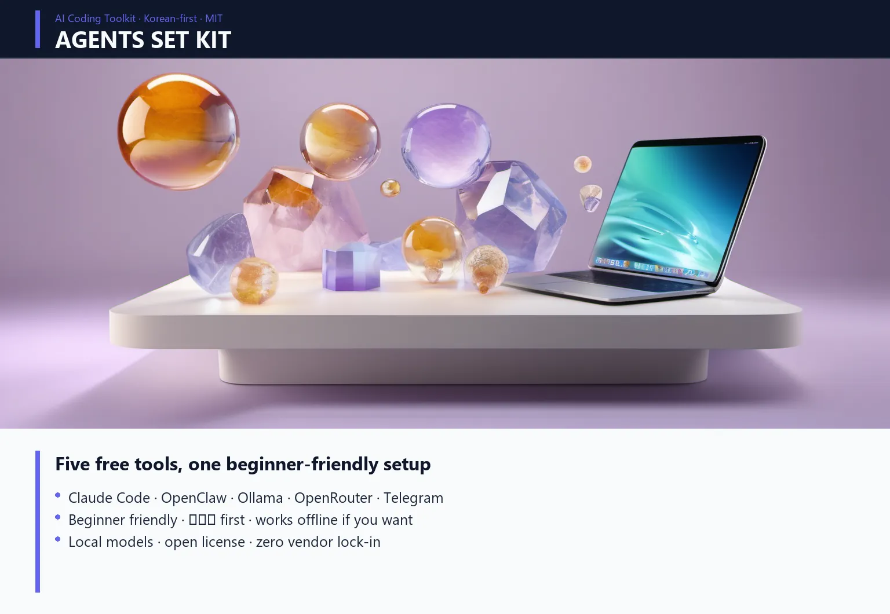

# Agents Set Kit

> **5개 AI 도구를 한 번에 셋업하는 한국어 가이드.**
> Claude Code · OpenClaw · Ollama · OpenRouter · Telegram 봇 — 처음부터 끝까지.


<!-- header-image -->


[](https://opensource.org/licenses/MIT)
[]()
[](README.md)
[](README.en.md)

🇰🇷 한국어 (현재) · 🇺🇸 [English](README.en.md)

---

## 🎯 이게 뭔가요

AI 도구 처음 쓰는 사람도 따라하면 **자기 컴퓨터에서 AI 에이전트 풀스택**이 돌아갑니다. 5개 도구가 서로 연결돼서.

**최종 결과**:
- 터미널에서 자연어로 AI한테 명령 (Claude Code)
- 무료 모델 여러 개를 한 곳에서 사용 (Ollama / OpenRouter / OpenClaw)
- 텔레그램으로 어디서든 AI에게 일 시키기
- 라이브 대시보드로 에이전트 작업 모니터링

**대상**:
- AI 처음 쓰는 사람 — 클릭 위치까지 명시
- "Claude.ai만 써봤는데 그 이상 가고 싶다"
- 커스텀 자동화 / 챗봇을 만들고 싶다

---

## 🆚 비슷한 키트와 뭐가 다른가요

GitHub에 [Claude Code](https://github.com/davila7/claude-code-templates) [관련](https://github.com/peterkrueck/Claude-Code-Development-Kit) [스타터](https://github.com/centminmod/my-claude-code-setup) 키트는 많습니다. 이 키트의 차별점:

| 항목 | 기존 인기 키트 | **Agents Set Kit** |
|------|---------------|--------------------|
| 언어 | 영어만 | **한국어 우선 + 영어 병행** |
| 범위 | Claude Code 단일 | **Claude Code + OpenClaw + Ollama + OpenRouter + Telegram 통합** |
| 비용 | Claude Pro $20/월 가정 | **무료 한도 + 무료 모델 + 로컬로 월 $0 가능** |
| 대상 | 개발자/CC 구독자 | **AI 처음 쓰는 입문자 (클릭 위치까지 명시)** |
| 구성 | 컨피그/플러그인 모음 | **단계별 셋업 가이드 (01 → 08)** |

요약: "한국어로, 무료로, 처음부터, 5개 도구를 다 연결되게" 하는 키트가 없어서 만들었습니다.

---

## 🚀 빠른 시작 (5분 — Quick Path)

### 사전 요구사항
- 노트북 (Windows / Mac / Linux)
- 인터넷 연결
- 이메일 계정 (가입용)
- (선택) 휴대폰 (텔레그램 봇용)

### 5분 안에 Claude Code 동작까지

```bash
# 1. Node.js 설치 (https://nodejs.org/ko 에서 LTS)

# 2. Claude Code 설치
npm install -g @anthropic-ai/claude-code

# 3. 작동 확인
claude --version

# 4. 첫 실행 (브라우저 로그인 자동)
claude

# 5. Claude Code 안에서:
안녕? 한국어로 답해줘.
```

여기까지 됐으면 → [docs/03-claude-code.md](docs/03-claude-code.md) 읽고 더 깊이 들어가기.

---

## 🆕 v3.0.1 원클릭 키트 (2026-05-02, BETA)

OpenClaw + Gemini 3.1 Pro Preview + Telegram 봇을 **15~20분에** 셋업하는 자동화 키트.

| | Windows | Mac |
|---|---|---|
| 📁 폴더 | [`kits/agent_kit_v3/windows/`](kits/agent_kit_v3/windows/) | [`kits/agent_kit_v3/mac/`](kits/agent_kit_v3/mac/) |
| 진입점 | `01_여기를_더블클릭하세요.bat` | `01_여기를_더블클릭하세요.command` |
| 베이스 | openclaw-desktop .exe (마법사 GUI) | openclaw 공식 install.sh + onboard CLI |

→ 자세한 사용법: [`kits/agent_kit_v3/README.md`](kits/agent_kit_v3/README.md)
→ 베타 테스터 환영 — [Issue 등록](https://github.com/wildeconforce/agents-set-kit/issues/new?template=beta_test_report.md)

---

## 📚 단계별 가이드

순서대로 따라하면 됩니다. 각 단계 10~30분.

| 단계 | 내용 | 시간 | 필수도 |
|-----|------|------|--------|
| [01](docs/01-ai-services-signup.md) | AI 서비스 가입 (Claude / ChatGPT / Gemini) | 15분 | 필수 |
| [02](docs/02-nodejs-install.md) | Node.js 설치 | 5분 | 필수 |
| [03](docs/03-claude-code.md) | Claude Code 설치 + 첫 명령 | 15분 | 필수 |
| [04](docs/04-openclaw.md) | OpenClaw — 멀티모델 셋업 | 30분 | 권장 |
| [05](docs/05-openrouter-free.md) | OpenRouter 무료 모델 | 20분 | 권장 |
| [06](docs/06-ollama-local.md) | Ollama — 로컬 모델 (선택) | 30분 | 선택 |
| [07](docs/07-telegram-bot.md) | 텔레그램 봇 연동 | 30분 | 권장 |
| [08](docs/08-agents-hq-dashboard.md) | 라이브 대시보드 (선택) | 30분 | 선택 |
| [00](docs/troubleshooting.md) | 막힐 때 | — | 참조 |

---

## 🛠️ 자동 설치 스크립트

### Windows (PowerShell)
```powershell
# 관리자 권한으로 PowerShell 실행 후:
iwr -useb https://raw.githubusercontent.com/wildeconforce/agents-set-kit/main/scripts/install-windows.ps1 | iex
```

### Mac / Linux
```bash
curl -sSL https://raw.githubusercontent.com/wildeconforce/agents-set-kit/main/scripts/install-mac.sh | bash
```

스크립트는:
- Node.js 확인 (없으면 설치 안내)
- Claude Code 설치
- OpenClaw 설치 (선택)
- 모든 단계 검증

설치 후:
```bash
# 검증
bash scripts/verify.sh   # Mac
.\scripts\verify.ps1     # Windows
```

---

## 💡 작동 원리 (개략)

```
[당신]
  ├─ 브라우저 → Claude.ai / ChatGPT / Gemini  (가벼운 사용)
  ├─ 터미널 → Claude Code  (메인 워크스페이스)
  │            ├─ 파일 / 코드 직접 만짐
  │            ├─ 자동화 워크플로우
  │            └─ Telegram 플러그인 → 폰에서도 명령
  └─ 터미널 → OpenClaw  (무료 모델 백업)
              ├─ OpenRouter (원격 무료)
              └─ Ollama (로컬 무료)
```

---

## 🤔 자주 묻는 질문

**Q: 비용 들어요?**
A: 100% 무료로 시작 가능. Claude / ChatGPT / Gemini 무료 한도 + OpenRouter 무료 모델 + Ollama 로컬 = 월 $0.

**Q: Mac이랑 Windows 둘 다 되나요?**
A: 네. 명령어 거의 동일. 가이드는 양쪽 다 명시.

**Q: 영어 잘 못해도 돼요?**
A: 네. 한국어로 자연스럽게 명령 가능. 가이드도 한국어로 작성.

**Q: 설치 도중 막히면?**
A: [docs/troubleshooting.md](docs/troubleshooting.md) 먼저 확인. 그래도 안 되면 [Issues](https://github.com/wildeconforce/agents-set-kit/issues)에 등록.

**Q: 회사 노트북에서도 되나요?**
A: 권한 정책에 따라 다름. `npm install -g`가 막히면 IT 부서 협의 필요.

**Q: 다른 인기 Claude Code 키트(awesome-claude-code, claude-code-templates 등)와 같이 쓸 수 있나요?**
A: 네. 이 키트로 "환경 셋업"을 끝낸 후, 그쪽 키트의 agents/skills/commands를 추가로 가져다 쓰면 됩니다. 충돌 X.

---

## 🧰 이 키트가 만들어진 배경

[wildeconforce.com](https://wildeconforce.com) 운영자가 5개월간 AI 에이전트 스택을 직접 빌드하면서 만난 함정 / 회피 / 셋업 패턴을 모아놨습니다.

**관련 글**:
- [에이전트 셋업 7번의 함정과 탈출](https://wildeconforce.com/posts/2026-04-27-agent-setup-7-traps)
- [텔레그램 양방향 복구기](https://wildeconforce.com/posts/2026-04-28-telegram-recovery)
- [V4.2 → V4.3.1 백테 일지](https://wildeconforce.com/posts/2026-04-27-v42-v431-grid-search-overfit)

---

## 📜 라이선스

MIT License — 자유롭게 fork / 수정 / 재배포 가능.

기여 환영 — Pull Request, Issue, 또는 [@wildeconforce](https://x.com/wildeconforce) DM.

---

## ⭐ 도움이 됐다면

레포에 ⭐ 부탁드립니다. 다른 사람도 찾기 쉬워집니다.

빌드하면서 만든 거 [#agents_set_kit](https://x.com/hashtag/agents_set_kit)으로 공유해주시면 RT.