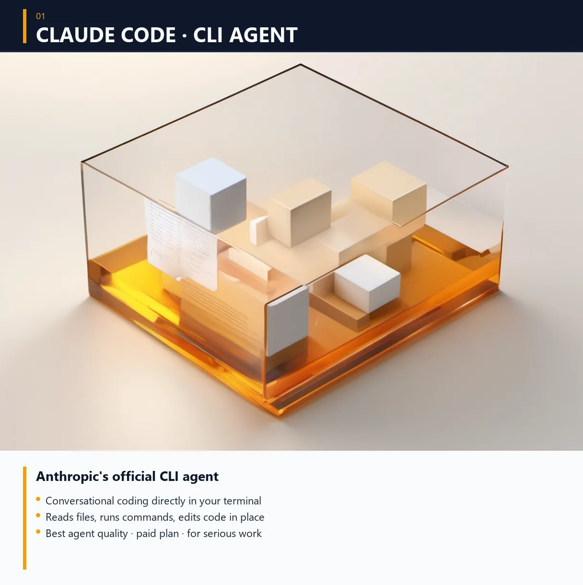

# 03 — Claude Code 설치

<!-- header-image -->



> **목표**: 터미널에서 Claude한테 자연어로 명령.
> **시간**: 15분.

[Claude Code](https://docs.anthropic.com/claude-code)는 Anthropic 공식 CLI. 브라우저 Claude의 슈퍼 파워 버전 — 파일 / 코드 / 명령어 직접 다룸.

---

## ✅ 설치

### 한 줄
```bash
npm install -g @anthropic-ai/claude-code
```

### 권한 오류 시

**Mac**:
```bash
sudo npm install -g @anthropic-ai/claude-code
```

**Windows**: PowerShell을 **관리자 권한**으로 다시 열고 실행

### 작동 확인
```bash
claude --version
```
→ `Claude Code 1.x.x` 같은 출력

---

## ✅ 첫 실행 + 로그인

```bash
claude
```

1. 자동으로 브라우저가 열림 (Anthropic 로그인 페이지)
2. 가입 / 로그인
3. "Authorize Claude Code" 버튼 클릭
4. 브라우저 → "Authentication successful"
5. 터미널로 돌아가면 → 로그인 완료, 첫 프롬프트 대기

### 브라우저 자동으로 안 열리는 경우
터미널에 출력된 URL을 수동으로 복사 → 브라우저 주소창에 붙여넣기.

---

## ✅ 첫 명령

Claude Code 안에서 자연스러운 한국어로:

```
안녕? 한국어로 답해줘.
```

응답 받으면 작동 OK.

### 더 어려운 명령

**현재 폴더 분석**:
```
이 폴더에 무슨 파일이 있는지 알려줘.
```
→ Claude가 자동으로 `ls` 같은 명령 실행해서 알려줌.

**파일 요약**:
```
README.md 파일을 읽고 핵심 3개 알려줘.
```

**코드 작성**:
```
hello.py 만들어줘. "안녕 세상" 한국어로 출력하는.
실행도 해줘.
```
→ Claude가 파일 만들고 + python 실행 + 결과 보여줌.

---

## 🎓 핵심 사용법

### 1. 자연어로 명령
영어 / 한국어 다 OK. 정확한 명령이 아닌 의도를 적으면 됨.

```
어제 작성한 일지 정리해서 블로그 글로 만들어줘.
```

### 2. 파일 / 폴더 컨텍스트
Claude는 현재 디렉토리(working directory)를 기본 컨텍스트로 봄.
다른 폴더 작업하려면:
```
/cd C:\Users\user\my-project
```
또는 절대 경로 명시:
```
C:\Users\user\my-project\app.py 분석해줘.
```

### 3. 슬래시 명령
```
/help        # 도움말
/cd <path>   # 작업 디렉토리 변경
/clear       # 대화 초기화
/resume      # 이전 대화 이어가기
/exit        # 종료
```

### 4. 위험한 명령은 허락 받음
파일 삭제 / 시스템 명령은 매번 사용자한테 물어봄. 무작정 허락 X — 명령 읽고 OK인지 확인.

---

## 💡 활용 예시 — 첫 주 한 가지씩

| 일 | 시도 |
|----|------|
| 1일차 | "이 폴더 파일 정리해줘" — 파일 목록 받기 |
| 2일차 | 본인 글 1개 → "한국어 어색한 부분 다듬어줘" |
| 3일차 | "오늘 일과 회고 짧게 정리해줘" → 텍스트 일지 |
| 4일차 | 파이썬 한 줄 — "지금 날씨 보여주는 코드 짜줘" |
| 5일차 | "내 GitHub 프로필 README 새로 써줘" |

작은 거부터. 결국 본인 워크플로우의 일부가 됨.

---

## 🚧 문제 해결

### 응답이 영어로만 옴
프롬프트 끝에 `한국어로 답해줘` 추가.
또는 첫 메시지로 한 번:
```
이제부터 항상 한국어로 답변.
```

### 응답이 너무 길음
```
짧게.
```
또는:
```
한 문장으로.
```

### 사용 한도 초과
- 무료 한도는 시간당 / 일당 제한
- 한도 도달하면 다음 시간까지 대기
- 또는 Claude Pro ($20/월) 결제

### `claude` 명령이 안 먹음 (설치 후)
- 새 터미널 창 열기
- `npm root -g`로 npm 글로벌 경로 확인 → PATH에 있는지 확인

---

## ✅ 여기까지 됐다면

축하합니다. 이미 AI 에이전트 시작점을 가진 셈. 90% 사용자는 여기까지로 충분.

더 깊이 들어가려면:
- [04-openclaw.md](04-openclaw.md) — 무료 모델 여러 개 (비용 절감)
- [07-telegram-bot.md](07-telegram-bot.md) — 폰에서 명령 (자동화)
- [08-agents-hq-dashboard.md](08-agents-hq-dashboard.md) — 라이브 대시보드 (모니터링)