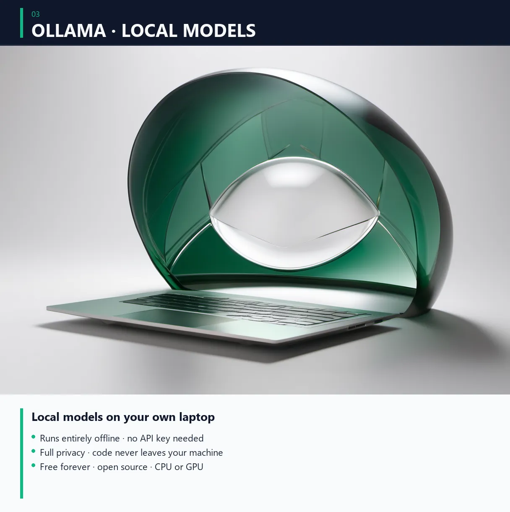

# 06 — Ollama 로컬 모델

<!-- header-image -->



> **목표**: 본인 PC에서 AI 모델 실행 — 무한정 무료, 데이터 외부 X.
> **시간**: 30분 (다운로드 시간 포함).

Ollama는 LLM을 로컬에서 돌리는 도구. 인터넷 끊겨도 작동, API 비용 0, 데이터 외부로 안 나감.

---

## ⚠️ 사전 요구 사항

### 권장 사양
- RAM 16GB 이상 (8GB도 가능, 작은 모델만)
- GPU (NVIDIA 권장, 없어도 CPU로 가능 — 느림)
- 디스크 여유 20GB+ (모델 1개당 ~5~10GB)

### 안 권장
- 노트북 4GB RAM — 너무 느림
- Intel 통합 그래픽 — 작은 모델만

---

## ✅ 설치

### Windows
```powershell
winget install Ollama.Ollama
```
또는 https://ollama.com/download/windows 에서 .exe 다운로드.

### Mac
```bash
brew install ollama
```
또는 https://ollama.com/download/mac 에서 .dmg 다운로드.

### Linux
```bash
curl -fsSL https://ollama.com/install.sh | sh
```

### 작동 확인
```bash
ollama --version
```

---

## ✅ 모델 다운로드

### 권장 — Qwen 2.5 7B (균형형, 한국어 native)
```bash
ollama pull qwen2.5:7b
```
~4.4GB, 다운로드 5~15분.

### 추천 모델 매트릭스

| 모델 | 크기 | RAM 요구 | 특징 |
|------|------|----------|------|
| `qwen2.5:7b` | 4.7GB | 8GB+ | 한국어 native, 균형 |
| `qwen2.5:14b` | 9GB | 16GB+ | 더 똑똑 |
| `qwen2.5-coder:7b` | 4.7GB | 8GB+ | 코드 특화 |
| `llama3.2:3b` | 2GB | 4GB+ | 가벼움 |
| `llama3.3:70b` | 43GB | 64GB+ | 대형 (서버급) |
| `deepseek-r1:7b` | 4.7GB | 8GB+ | 추론 강함 (단 tools 미지원) |
| `deepseek-r1:14b` | 9GB | 16GB+ | 추론, 더 똑똑 |
| `gpt-oss:20b` | 13GB | 16GB+ | OpenAI 오픈소스 |

### 모델 목록 보기
```bash
ollama list
```

### 모델 삭제
```bash
ollama rm qwen2.5:7b
```

---

## ✅ 첫 실행

### 직접 대화
```bash
ollama run qwen2.5:7b
```
모델 채팅 화면 — 입력하면 응답. 종료: `/bye`.

### 한국어 테스트
```
한국어로 답변해줘.
양자 컴퓨터 5살 어린이한테 1줄로 설명해줘.
```

---

## ✅ 환경 변수 — 컨텍스트 길이

기본 컨텍스트는 4096 토큰 (작음). 에이전트 작업엔 부족.

### 늘리기 (영구)

**Windows**:
```powershell
setx OLLAMA_CONTEXT_LENGTH 32768
```

**Mac/Linux**:
```bash
echo 'export OLLAMA_CONTEXT_LENGTH=32768' >> ~/.zshrc
source ~/.zshrc
```

Ollama 재시작 후 적용.

---

## ✅ OpenClaw / Claude Code 통합

### OpenClaw에 등록
환경 변수 셋업 (위 OLLAMA_CONTEXT_LENGTH 처럼):
```bash
export OLLAMA_API_KEY="ollama-local"
```

OpenClaw config 추가:
```bash
openclaw config set models.providers.ollama.baseUrl "http://localhost:11434/v1"
openclaw config set models.providers.ollama.apiKey "ollama-local"
```

또는 직접 `~/.openclaw/openclaw.json` 편집:
```json
{
  "models": {
    "providers": {
      "ollama": {
        "baseUrl": "http://localhost:11434/v1",
        "apiKey": "ollama-local",
        "api": "openai-completions",
        "models": [
          {
            "id": "qwen2.5:7b",
            "name": "Qwen 2.5 7B",
            "input": ["text"],
            "cost": {"input": 0, "output": 0, "cacheRead": 0, "cacheWrite": 0},
            "contextWindow": 32768,
            "maxTokens": 8192
          }
        ]
      }
    }
  }
}
```

기본 모델로 설정:
```bash
openclaw models set ollama/qwen2.5:7b
```

---

## ⚠️ Tools 지원 확인

OpenClaw는 tool calling 기반. 모델이 tools 지원 안 하면 에이전트 작업 X.

### 모델 capabilities 확인
```bash
curl -s http://localhost:11434/api/show -d '{"name":"qwen2.5:7b"}' | grep capabilities
```

| 모델 | tools | 권장 |
|------|-------|------|
| `qwen2.5:7b` | ✅ | OK |
| `qwen2.5-coder:7b` | ✅ | OK |
| `llama3.2:3b` | ✅ | OK |
| `llama3.3:70b` | ✅ | OK |
| `deepseek-r1:*` | ❌ | **에이전트 X**, 채팅만 |

---

## 🚧 문제 해결

### Ollama 데몬 안 돌고 있음
```bash
# Mac/Linux
ollama serve

# Windows — Ollama 트레이 앱이 자동 실행됨, 안 되면:
"C:\Program Files\Ollama\ollama.exe" serve
```

### 응답이 매우 느림
- GPU 없으면 CPU로 실행 → 느림 (1~5 토큰/초)
- 작은 모델 사용 (qwen2.5:7b → llama3.2:3b)
- 또는 클라우드 모델 (OpenRouter) 사용

### "model not found"
모델 이름 정확히 (대소문자 구분):
```bash
ollama list  # 설치된 거 확인
ollama pull qwen2.5:7b  # 정확한 이름으로
```

### Out of memory
RAM 부족. 작은 모델 사용 또는 PC 업그레이드.

---

## 💡 사용 팁

### 24/7 운영
PC 켜두면 OpenClaw / Claude Code가 백그라운드로 작업 가능. 텔레그램 봇 연동 시 폰에서 명령.

### 데이터 보안
로컬 = 외부로 안 나감. 민감한 정보 (코드 / 문서) 자유롭게 던질 수 있음.

### 비용 비교
- Claude API 풀가동 24/7: ~$200/월
- OpenRouter 무료: $0 (한도 안에서)
- Ollama 로컬: $0 (전기료 ~$5/월)

---

## ✅ 다음 단계

- [07-telegram-bot.md](07-telegram-bot.md) — 폰에서 명령 (자동화의 시작)
- 또는 본인 워크플로우에 통합