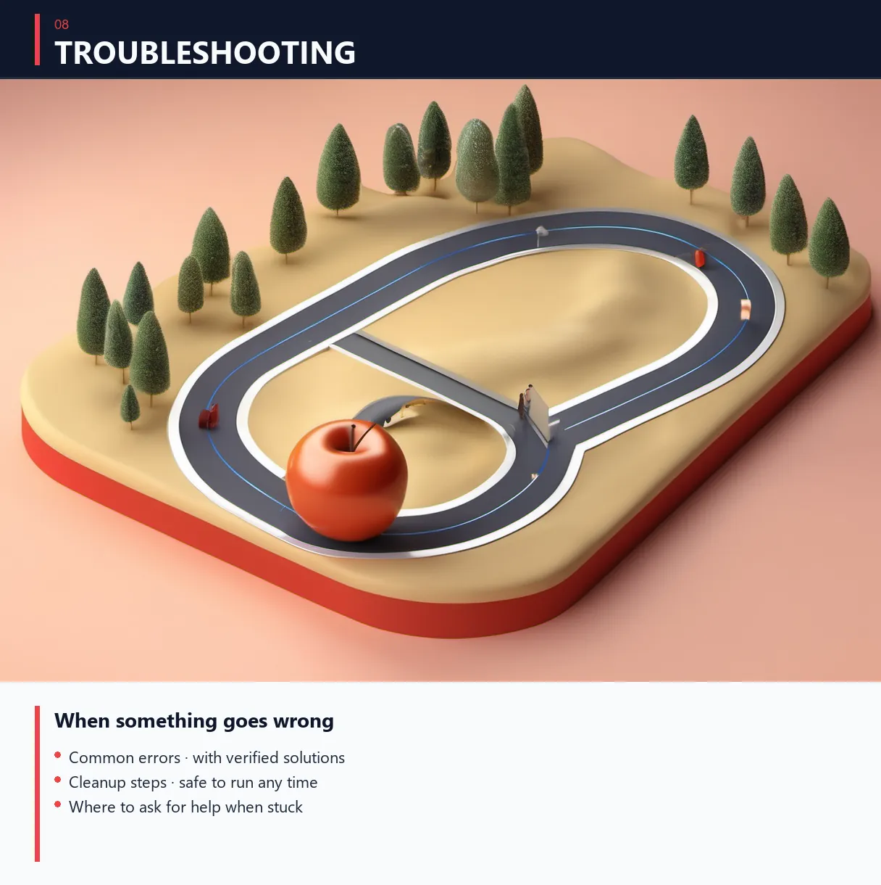

# 🆘 Troubleshooting — 막힐 때 처음 보는 곳

<!-- header-image -->


---

## ⚡ 강의 중 핫픽스 (2026-04-30) — OpenClaw `baseUrl` 누락 에러

### 증상
```
🦞 OpenClaw 2026.4.27 (cbc2ba0) — I keep secrets like a vault...

Error: Config validation failed: models.providers.openrouter.baseUrl:
Invalid input: expected string, received undefined
```

### 원인
OpenClaw 2026.4.27 버전부터 `models.providers.openrouter.baseUrl` 필드가 **필수**.
이전 버전은 기본값 자동 사용했지만, 새 버전은 명시적으로 적어줘야 함.

### 즉시 해결 (한 줄, 폴더+파일 자동 생성 포함)

OpenClaw 처음 쓰는 학생도 한 줄로 끝. **빈 config 만들고 baseUrl 설정까지 한 번에.**

**Windows CMD (검은 명령 프롬프트):**

```
if not exist "%USERPROFILE%\.openclaw" mkdir "%USERPROFILE%\.openclaw" & if not exist "%USERPROFILE%\.openclaw\openclaw.json" echo {} > "%USERPROFILE%\.openclaw\openclaw.json" & openclaw config set models.providers.openrouter.baseUrl https://openrouter.ai/api/v1
```

**Windows PowerShell (파란 창):**

```
$d="$env:USERPROFILE\.openclaw"; if(!(Test-Path $d)){mkdir $d|Out-Null}; if(!(Test-Path "$d\openclaw.json")){'{}'|Out-File "$d\openclaw.json" -Encoding utf8}; openclaw config set models.providers.openrouter.baseUrl https://openrouter.ai/api/v1
```

**Mac / Linux:**

```
mkdir -p ~/.openclaw && echo '{}' > ~/.openclaw/openclaw.json && openclaw config set models.providers.openrouter.baseUrl https://openrouter.ai/api/v1
```

엔터 → 다시 `openclaw` 실행. 끝.

> 위 코드 박스(```)는 마크다운 표시용이니 명령 안의 텍스트만 복사하세요.

### 작동 확인

```
openclaw --version
openclaw
```

`baseUrl: ... undefined` 에러 사라지면 OK.

### 안 먹으면 — config 파일 직접 편집

위치:
- Windows: `C:\Users\<유저>\.openclaw\openclaw.json`
- Mac/Linux: `~/.openclaw/openclaw.json`

해당 섹션을 다음과 같이:

```json
{
  "models": {
    "providers": {
      "openrouter": {
        "apiKey": "sk-or-v1-여러분의키",
        "baseUrl": "https://openrouter.ai/api/v1"
      }
    }
  }
}
```

저장 → `openclaw` 재실행.

---


## 🔍 진단 우선순위

순서대로 시도:
1. **새 터미널 창 열기** (60% 문제 해결)
2. **`/exit` + `claude --continue`** (Claude Code 재시작)
3. **인터넷 연결 확인**
4. **이 문서에서 증상 검색**

---

## 📦 설치 단계

### `npm: command not found`
**원인**: Node.js 미설치 또는 PATH 미적용
**해결**:
- Node.js 설치 확인: https://nodejs.org/ko (LTS)
- 설치 후 **새** 터미널 창 열기
- Mac: `source ~/.zshrc`

### `EACCES: permission denied`
**Mac/Linux**:
```bash
sudo npm install -g <패키지>
```

**Windows**: PowerShell 우클릭 → "관리자 권한으로 실행" → 다시 명령

### `ENOENT: no such file or directory`
**원인**: npm 캐시 손상
**해결**:
```bash
npm cache clean --force
npm install -g <패키지>
```

### Windows에서 `node`는 되는데 `npm`은 안 됨
**해결**: Node.js 재설치 (npm 같이 설치됨)

---

## 🤖 Claude Code

### `claude` 명령 인식 안 됨 (설치 후)
**해결**:
1. 새 터미널 창
2. `npm root -g` → 출력 경로가 PATH에 있는지 확인
3. Windows: `%APPDATA%\npm` → 환경 변수 PATH에 추가

### 첫 로그인 시 브라우저 안 열림
**해결**: 터미널의 URL 수동 복사 → 브라우저 주소창에 붙여넣기

### 응답이 영어로만 옴
**해결**:
```
이제부터 항상 한국어로 답변.
```

### 사용 한도 초과
**해결**:
- 다음 시간 / 다음 날까지 대기
- 또는 OpenClaw + 무료 모델로 전환

### `/exit` 후 다시 못 들어감
**해결**:
```bash
claude --continue
```

---

## 📦 OpenClaw

### `openclaw` 명령 인식 안 됨
**해결**: Claude Code랑 동일. 새 터미널 / `npm root -g` 확인.

### "Unknown model" 에러
**원인**: OpenClaw 정적 카탈로그에 없는 모델
**해결**:
```bash
openclaw models list --all  # 사용 가능한 모델 확인
```
원하는 모델이 없으면 → 비슷한 다른 모델 사용.

### Config 파일 깨짐
**해결**:
```bash
# 백업 후 초기화
mv ~/.openclaw/openclaw.json ~/.openclaw/openclaw.json.bak
openclaw  # 자동 재생성
```

### 모델 호출 시 에러 무한
**해결**:
```bash
openclaw doctor --fix
```

---

## 🌐 OpenRouter

### `429 rate-limited`
**원인**: 무료 한도 초과
**해결**: 다른 모델로 전환 (fallback 체인 활용)

### `401 unauthorized`
**원인**: API 키 잘못됨
**해결**:
- https://openrouter.ai/keys 가서 키 재확인
- 환경 변수 / config 다시 등록

### "no endpoints found"
**원인**: 모델이 일시 비활성
**해결**: 다른 무료 모델로 전환

---

## 💻 Ollama

### 데몬 안 돌고 있음
```bash
# 수동 시작
ollama serve

# Windows: 트레이 앱 클릭 또는
"C:\Program Files\Ollama\ollama.exe" serve
```

### 응답 매우 느림 (CPU 모드)
**해결**:
- 작은 모델로 (`qwen2.5:7b` → `llama3.2:3b`)
- 또는 클라우드 모델 (OpenRouter) 사용

### Out of memory
**원인**: RAM 부족
**해결**: 작은 모델 사용 또는 다른 앱 종료

### 모델 컨텍스트가 짧음 (4k)
**해결**: 환경 변수 설정
```bash
export OLLAMA_CONTEXT_LENGTH=32768
```
(Windows: `setx OLLAMA_CONTEXT_LENGTH 32768`)
Ollama 재시작 후 적용.

---

## 📱 텔레그램 봇

### 봇 응답 없음 (typing 표시 안 됨)
**원인**: 토큰 잘못 또는 Claude Code 미실행
**해결**:
- `@BotFather → /mybots` → 봇 → "API Token" 재확인
- Claude Code 실행 중인지 (`claude` 켜져 있어야)

### 봇 응답 없음 (typing은 표시됨) ⚠️
**원인 (가장 흔함)**: `--channels` 플래그 누락 (npm 업데이트 후)
**해결**:
1. 진단:
   ```bash
   # Mac/Linux
   cat ~/.npm-global/bin/claude | grep channels

   # Windows
   type %APPDATA%\npm\claude.cmd | findstr channels
   ```
2. 빈 출력이면 → shim 재패치:
   - npm shim 파일 열기
   - `claude.exe` 호출 부분 앞에 `--channels plugin:telegram@claude-plugins-official` 추가
3. Claude Code 재시작 (`/exit` + `claude --continue`)

### 토큰 노출됨
**해결**: 즉시 BotFather → `/mybots` → 봇 → "Revoke Token" → 새 토큰 발급 → `.env` 업데이트

### 다른 사람도 봇 쓰게 하려면
`~/.claude/channels/telegram/access.json` 편집:
```json
{
  "allowFrom": ["내ID", "친구ID"]
}
```

---

## 🌐 일반 / 네트워크

### 한국 IP 차단 (드물게)
**증상**: 페이지 로드 안 됨, 가입 안 됨
**해결**: VPN (Cloudflare WARP 무료, 1.1.1.1 앱)

### npm 매우 느림
한국 미러:
```bash
npm config set registry https://registry.npmmirror.com/
```
원래로:
```bash
npm config set registry https://registry.npmjs.org/
```

### 와이파이 끊김 (강의 중)
- 휴대폰 핫스팟 켜기
- 모바일 데이터로 임시 작업

---

## 🔍 진단 도구

### 시스템 점검 한 번에
```bash
# Mac/Linux
node --version && npm --version && claude --version && openclaw --version

# Windows PowerShell
node --version; npm --version; claude --version; openclaw --version
```

### 텔레그램 봇 상태
```bash
curl https://api.telegram.org/bot<토큰>/getMe
```

### Claude Code shim 상태
```bash
# Mac/Linux
which claude
cat $(which claude) | grep channels

# Windows
where claude
type "%APPDATA%\npm\claude.cmd"
```

---

## 💬 더 막히면

### 1차 — 본인 검색
- Google 영어 검색: 에러 메시지 그대로 복붙
- ChatGPT/Claude에게 에러 메시지 던지기

### 2차 — 커뮤니티
- [Issues](https://github.com/wildeconforce/agents-set-kit/issues) — 비슷한 문제 검색
- 없으면 New Issue 생성 (에러 메시지 / 환경 / 시도한 것 명시)

### 3차 — 직접 연락
- X DM: [@wildeconforce](https://x.com/wildeconforce)
- Email: redjacker84@gmail.com

---

## 📝 Issue 작성 가이드

### 좋은 Issue
```
제목: [Mac] Claude Code 설치 후 'claude' 명령 인식 안 됨

환경:
- macOS Sonoma 14.5
- Node.js v22.0.0
- 명령: npm install -g @anthropic-ai/claude-code (sudo 사용)

증상:
- 설치 끝났는데 'claude' 치면 'command not found'
- 새 터미널 열어도 동일

시도한 것:
1. source ~/.zshrc — 효과 없음
2. echo $PATH — /usr/local/bin 있음
3. npm root -g — /usr/local/lib/node_modules

기대: claude --version 출력
실제: command not found
```

### 안 좋은 Issue
```
설치가 안 돼요. 어떻게 해야 하나요?
```
(환경, 명령, 에러 명시 X — 답변 어려움)